# Cubierta Forestal MLOps · MLflow

Pipeline MLOps de extremo a extremo para el dataset Covertype (clasificación del tipo de cubierta forestal, `cover_type` de 0 a 6). Una base PostgreSQL de negocio se restaura desde un dump (`training.covertype_features`), un notebook de Jupyter entrena 25 configuraciones y las registra como experimentos en MLflow, el mejor modelo se publica en el Model Registry con el alias `production`, los artefactos viven en MinIO y un servicio FastAPI carga `models:/cubierta-forestal@production` y lo expone en `POST /predict`. Todo se levanta con Docker Compose.

## Ruta rápida

1. Levantar el stack (la primera vez construye las imágenes y restaura los datos):

   ```bash
   docker compose up -d --build
   ```

2. Abrir MLflow en <http://localhost:5001>. El puerto del host es 5001 porque el receptor AirPlay de macOS ocupa el 5000.
3. Abrir Jupyter en <http://localhost:8888> con el token `cubierta` y ejecutar `notebooks/cubierta_forestal_experimentos.ipynb` completo (Run All). Entrena los 25 experimentos, los registra en MLflow y deja el modelo ganador en el Model Registry con el alias `production`.
4. Revisar los artefactos en la consola de MinIO <http://localhost:9001> (usuario `minioadmin`, contraseña `minioadmin`, bucket `mlflow`).
5. Verificar la API en <http://localhost:8000/health> (responde `200` cuando el modelo está cargado) y pedir una predicción:

   ```bash
   curl -s -X POST http://localhost:8000/predict -H 'Content-Type: application/json' -d '{
     "instances": [
       {"elevation": 3037, "aspect": 330, "slope": 12,
        "horizontal_distance_to_hydrology": 492, "vertical_distance_to_hydrology": -83,
        "horizontal_distance_to_roadways": 1806,
        "hillshade_9am": 192, "hillshade_noon": 226, "hillshade_3pm": 173,
        "horizontal_distance_to_fire_points": 2023,
        "wilderness_area": "commanche", "soil_type": "c7756"},
       {"elevation": 2616, "aspect": 176, "slope": 27,
        "horizontal_distance_to_hydrology": 351, "vertical_distance_to_hydrology": 88,
        "horizontal_distance_to_roadways": 927,
        "hillshade_9am": 223, "hillshade_noon": 242, "hillshade_3pm": 134,
        "horizontal_distance_to_fire_points": 1047,
        "wilderness_area": "commanche", "soil_type": "c2703"}
     ]
   }'
   ```

   Respuesta esperada (las dos filas provienen del split `test`, con clases reales 1 y 2):

   ```json
   {
     "predictions": [
       {"cover_type": 1, "confidence": 0.99996},
       {"cover_type": 2, "confidence": 0.99998}
     ],
     "model": {"name": "cubierta-forestal", "alias": "production", "version": "1"}
   }
   ```

   La documentación interactiva está en <http://localhost:8000/docs>.

> Si la API se levanta antes de que exista un modelo con el alias `production`, `/health` responde `503` hasta que el notebook lo registre. No hace falta reiniciarla: reintenta la carga del registro en la siguiente petición.

## Arquitectura

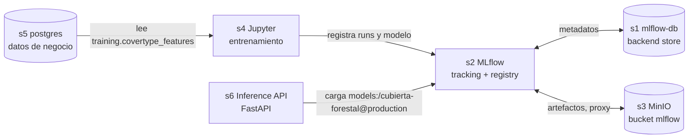

Hay dos instancias de PostgreSQL aisladas, cada una con su propio volumen: `mlflow-db` (solo backend store de MLflow, interna, no se publica en el host) y `postgres` (base de negocio que lee Jupyter).

| Servicio | URL | Credenciales | Rol |
|----------|-----|--------------|-----|
| `postgres` (s5, `cf-postgres`) | `localhost:5432` | `app` / `app`, base `cubierta_forestal` | Base de negocio; restaura un `pg_dump` en el primer arranque |
| `mlflow-db` (s1, `cf-mlflow-db`) | solo red interna | `mlflow` / `mlflow`, base `mlflow` | Backend store de MLflow |
| `minio` (s3, `cf-minio`) | API `localhost:9000`, consola <http://localhost:9001> | `minioadmin` / `minioadmin` | Almacén de artefactos (imagen Chainguard) |
| `minio-init` (`cf-minio-init`) | n/a | n/a | Tarea única que crea el bucket `mlflow` y termina |
| `mlflow` (s2, `cf-mlflow`) | <http://localhost:5001> | sin autenticación | Tracking server y Model Registry; sirve los artefactos por proxy hacia MinIO |
| `jupyter` (s4, `cf-jupyter`) | <http://localhost:8888> | token `cubierta` | Entrenamiento: lee `postgres`, registra en MLflow |
| `inference-api` (s6, `cf-inference-api`) | <http://localhost:8000> | sin autenticación | Sirve `models:/cubierta-forestal@production` |

## Datos en PostgreSQL

`services/postgres/init/001_schemas.sql` crea tres esquemas (capas tipo medallion). Los archivos de `init/` se aplican una sola vez, cuando el volumen está vacío.

| Esquema | Tabla | Contenido |
|---------|-------|-----------|
| `raw` | `raw.covertype` | Filas tal como llegaron, con linaje de ingesta |
| `processed` | `processed.covertype` | Filas limpias y tipadas, con restricciones `CHECK` y sin duplicados exactos |
| `training` | `training.dataset_version` | Una fila por versión de dataset (fracciones de split, semilla, notas) |
| `training` | `training.covertype_features` | Dataset versionado con la columna `split` (`train`, `validation`, `test`); es lo que lee el notebook |

Restauración: `services/postgres/init/002_restore_backup.sh` ejecuta `pg_restore --data-only --disable-triggers` sobre `services/postgres/backup/cubierta_forestal_2026-10-03.dump` (montado en `/backup`). Si el archivo no existe, omite la restauración.

Notas sobre los datos:

- `cover_type` está indexado desde 0 (`CHECK (cover_type BETWEEN 0 AND 6)` en `processed.covertype`; el notebook convierte con `- 1` cuando usa `fetch_covtype`).
- Las columnas categóricas `wilderness_area` y `soil_type` se guardan como texto (por ejemplo `commanche`, `c7756`); la codificación ocurre dentro del modelo.
- Las tablas están en esquemas distintos de `public`, por lo que hay que usar el prefijo de esquema.

```sql
SELECT version, row_count, created_at FROM training.dataset_version ORDER BY created_at DESC;

SELECT split, count(*) FROM training.covertype_features GROUP BY split;

SELECT cover_type, count(*) FROM training.covertype_features GROUP BY cover_type ORDER BY cover_type;
```

## Experimentos y registro del modelo

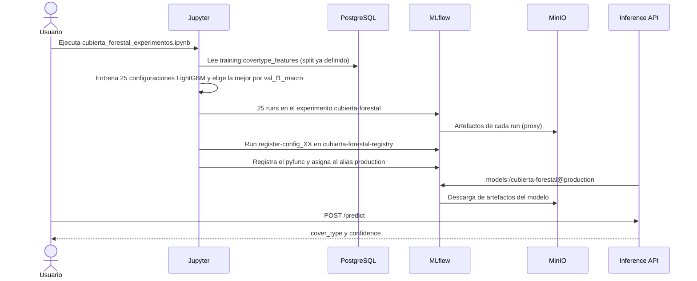

El notebook (`services/jupyter/notebooks/cubierta_forestal_experimentos.ipynb`) entrena un solo tipo de modelo, AutoGluon con LightGBM (clave `GBM`), sobre 25 configuraciones: 5 valores de `learning_rate` (0.01, 0.03, 0.05, 0.1, 0.2) por 5 niveles de capacidad y regularización (`num_leaves` de 15 a 255, `max_depth`, `num_boost_round`, `min_data_in_leaf`, `feature_fraction`, `bagging_fraction`, `lambda_l1`, `lambda_l2`). Los 12 atributos de entrada son crudos; se añade la característica `euclidean_distance_to_hydrology`. El split `test` permanece aislado y solo se evalúa una vez, sobre la ganadora.

| Qué se registra | Detalle |
|-----------------|---------|
| Parámetros | Hiperparámetros de la configuración, `model_family`, `dataset_version`, `n_features` |
| Métricas | `val_accuracy`, `val_balanced_accuracy`, `val_f1_macro`, `val_f1_weighted`, `val_precision_macro`, `val_recall_macro`, `val_log_loss`, `val_roc_auc_ovr_macro`; la ganadora añade las `test_*` equivalentes |
| Tags | `seed`, `problem_type`, `config_id`, `selected` (`true` solo en la ganadora), `dataset_version` |
| Artefactos | `configurations.json`, el payload JSON (`payload/`) y el directorio del modelo (`model/`), guardados en MinIO |

Selección y registro:

- La ganadora es la de mayor `val_f1_macro` (métrica principal, por el desbalance entre clases). En la ejecución local documentada fue `config_10`, con `val_f1_macro` 0.940831 y `test_f1_macro` 0.923057 (archivo local `artifacts/selected_model.json`, no versionado).
- El registro de runs es idempotente: los runs que ya existen en el experimento se omiten.
- La ganadora se registra como modelo `pyfunc` (`inference_api.covertype_model.CovertypeModel`) en un experimento aparte, `cubierta-forestal-registry`, bajo el nombre `MODEL_NAME` (`cubierta-forestal`), y se le asigna el alias `MODEL_ALIAS` (`production`).
- El contrato de entrada del modelo son las 12 columnas crudas (10 numéricas y 2 categóricas como texto); la salida es `cover_type` y `confidence`. El feature engineering viaja dentro del modelo, así que la API no lo replica.
- Jupyter y la API se construyen desde el mismo `Dockerfile` (targets `jupyter` y `api`) y el mismo `services/inference-api/uv.lock`, por lo que el modelo se serializa y se deserializa con las mismas versiones de librerías.

## Estructura del repositorio

```text
.
├── docker-compose.yml                # Stack completo (s1 a s6)
├── Dockerfile                        # Targets `jupyter` y `api`, comparten pyproject.toml y uv.lock
├── docs/images/                      # Capturas de evidencia
└── services/
    ├── inference-api/
    │   ├── pyproject.toml            # Dependencias y grupos (api, jupyter, dev)
    │   ├── uv.lock
    │   ├── README.md                 # Detalle de la API
    │   ├── src/inference_api/
    │   │   ├── main.py               # Endpoints /health y /predict
    │   │   ├── model.py              # Carga models:/<nombre>@<alias> desde el registry
    │   │   ├── schemas.py            # Contratos de entrada y salida
    │   │   ├── settings.py           # Configuración por variables de entorno
    │   │   └── covertype_model.py    # Wrapper pyfunc compartido con el notebook
    │   └── tests/                    # conftest, test_health, test_predict, test_covertype_model
    ├── jupyter/notebooks/
    │   ├── cubierta_forestal_experimentos.ipynb   # 25 experimentos y registro del modelo
    │   ├── README.md
    │   └── requirements.txt          # Solo referencia; las dependencias viven en pyproject.toml
    ├── mlflow/Dockerfile             # Imagen oficial de MLflow + psycopg2-binary y boto3
    └── postgres/
        ├── init/001_schemas.sql      # Esquemas y tablas
        ├── init/002_restore_backup.sh
        └── backup/cubierta_forestal_2026-10-03.dump
```

## Ejecutar las pruebas

Desde `services/inference-api` (requiere `uv`):

```bash
cd services/inference-api
uv sync --group api --group dev
uv run --group dev pytest -q
```

Las pruebas no necesitan un servidor MLflow: `tests/conftest.py` fija `LOAD_MODEL_ON_STARTUP=false` y cada prueba inyecta un modelo falso mediante `dependency_overrides`.

| Suite | Qué verifica |
|-------|--------------|
| `tests/test_health.py` | Sin modelo, `/health` responde `503` con `{"status": "degraded", "model": null, "version": null}` |
| `tests/test_predict.py` | Una predicción por instancia, `422` ante un campo faltante o un lote vacío, `/health` con modelo cargado, y que el ejemplo de OpenAPI sea una petición válida |
| `tests/test_covertype_model.py` | El feature engineering (distancia euclidiana, tipo `category`), el rechazo de columnas faltantes y la salida `cover_type` y `confidence` del wrapper |

## Operación diaria

| Tarea | Cómo |
|-------|------|
| Editar el notebook | Modificar `services/jupyter/notebooks/`; está montado como bind mount en `/workspace/notebooks`, no requiere reconstruir |
| Cambiar el código de la API | `docker compose up -d --build inference-api` |
| Promover otra versión del modelo | En la UI de MLflow (Model registry), mover el alias `production` a otra versión, o con `MlflowClient().set_registered_model_alias(...)`; luego `docker compose restart inference-api` (el alias se resuelve al arrancar) |
| Inspeccionar la base de negocio | `docker exec -it cf-postgres psql -U app -d cubierta_forestal` |
| Ver logs de un servicio | `docker compose logs -f inference-api` |
| Empezar desde cero | `docker compose down -v` borra los volúmenes `cubierta_forestal_postgres`, `cubierta_forestal_mlflow_db` y `cubierta_forestal_minio`; el siguiente `up` vuelve a restaurar el dump |

## Solución de problemas

- MLflow no responde en el puerto 5000: el host lo publica en 5001 porque el receptor AirPlay de macOS ocupa el 5000. Dentro de la red de Docker sigue siendo `http://mlflow:5000`.
- MLflow rechaza peticiones por el host: tiene una protección contra DNS rebinding. `--allowed-hosts` admite `localhost:*`, `127.0.0.1:*`, `mlflow:*` y `*.orb.local` (dominio de OrbStack). Si accedes con otro nombre de host, hay que añadirlo en `docker-compose.yml`.
- `/health` responde `503` o `/predict` responde `503`: aún no hay un modelo con el alias `production` (o MLflow no es alcanzable). Ejecuta el notebook completo; la API reintenta la carga en la siguiente petición.
- `\dt` no muestra tablas en `psql`: las tablas están en los esquemas `raw`, `processed` y `training`. Usa `\dt training.*` o el prefijo de esquema en las consultas.
- Cambios en `init/` no tienen efecto: los scripts solo corren con el volumen de `postgres` vacío. Usa `docker compose down -v`.
- MinIO: la imagen de Chainguard es de tipo distroless y corre como uid 65532; solo incluye `minio` y `mc`, por eso el healthcheck usa `mc ready local` y el bucket lo crea `minio-init`.
- El notebook falla por un paquete faltante: no instala nada en tiempo de ejecución. Agrega la dependencia con `uv add --group jupyter <paquete>` en `services/inference-api` y reconstruye la imagen.
- Error al importar LightGBM: la imagen necesita `libgomp1` (ya incluida en ambos targets del `Dockerfile`).

## Evidencias

### 1. Servicios en Docker Compose

Diagrama de arquitectura del stack (S1 a S6) y vista de los contenedores del proyecto `cubierta-forestal` en ejecución, con los logs de la API mostrando `GET /health`, `GET /docs` y `POST /predict` con respuesta `200`. `minio-init` aparece detenido porque es una tarea única.

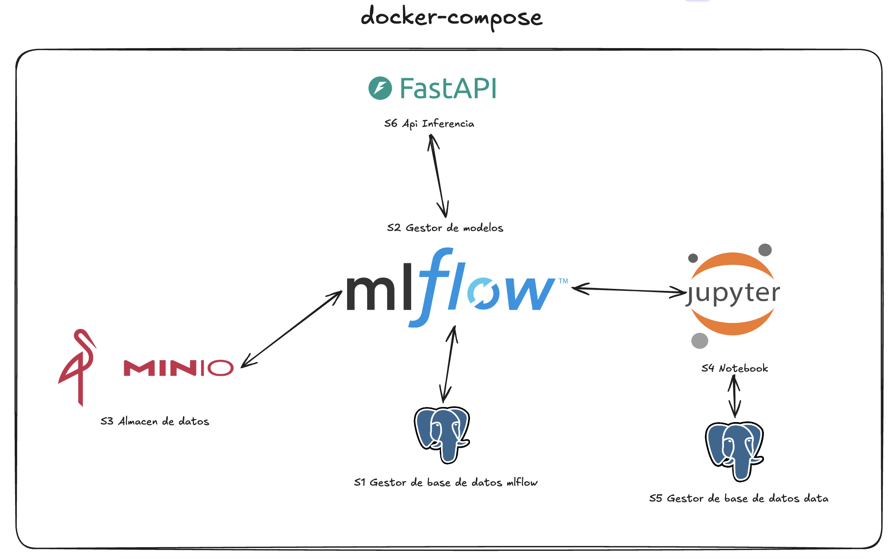

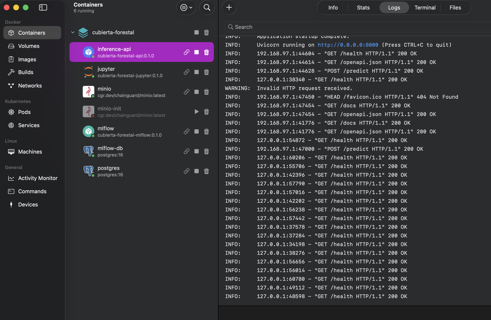

### 2. Backend store de MLflow en PostgreSQL

Cliente SQL conectado a la base de MLflow (`mlflow-db`): lista las tablas del backend store y la consulta `select * from experiments;` devuelve el experimento `Default` y el experimento `cubierta-forestal`.

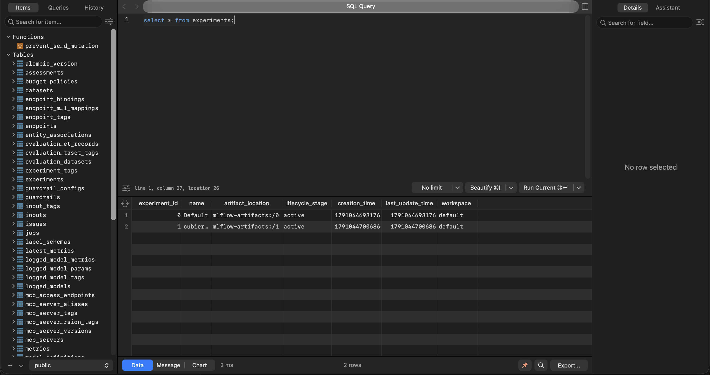

### 3. Datos de entrenamiento en PostgreSQL y notebook

Consulta `SELECT * FROM training.covertype_features;` sobre la base `cubierta_forestal` (PostgreSQL 16.15) con 90,825 filas, columnas `dataset_version`, `split` y las variables de entrada. A continuación, JupyterLab en `localhost:8888` mostrando la salida del notebook: mejor configuración `config_10` con `val_f1_macro` 0.9408, matriz de confusión y reporte de clasificación sobre validación.

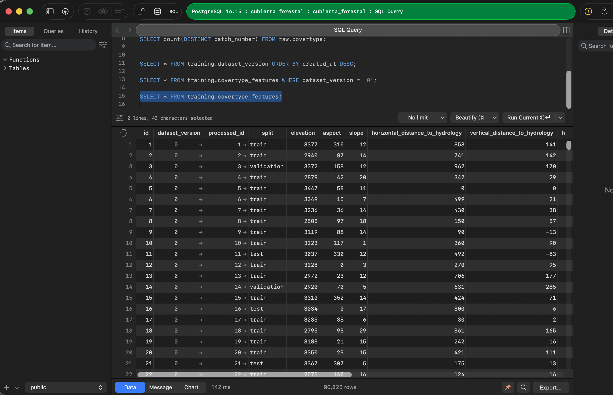

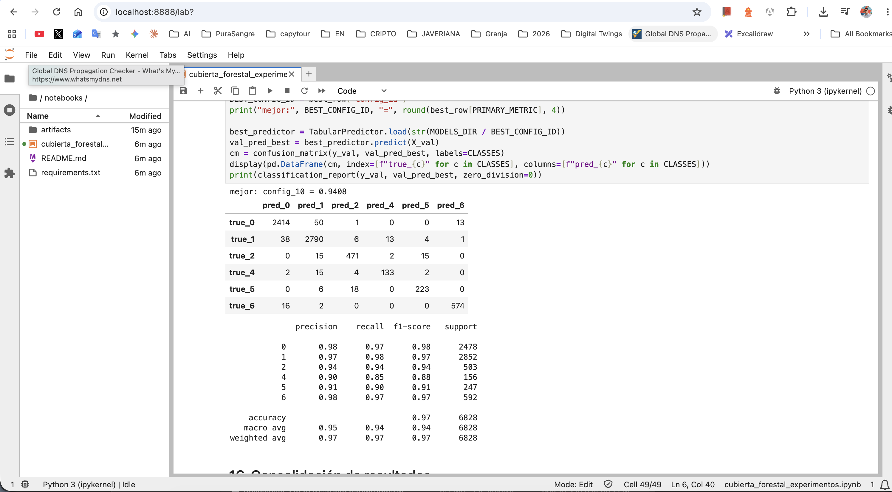

### 4. Experimentos y modelo en producción en MLflow

El experimento `cubierta-forestal` lista 25 runs (`Experiment 01` a `Experiment 25`). La segunda captura muestra la versión 1 del modelo registrado `cubierta-forestal` con el alias `production`, origen en el run `register-config_10` y esquema de 12 entradas y 2 salidas (`cover_type`, `confidence`).

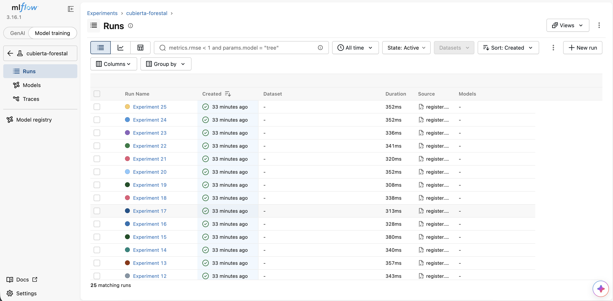

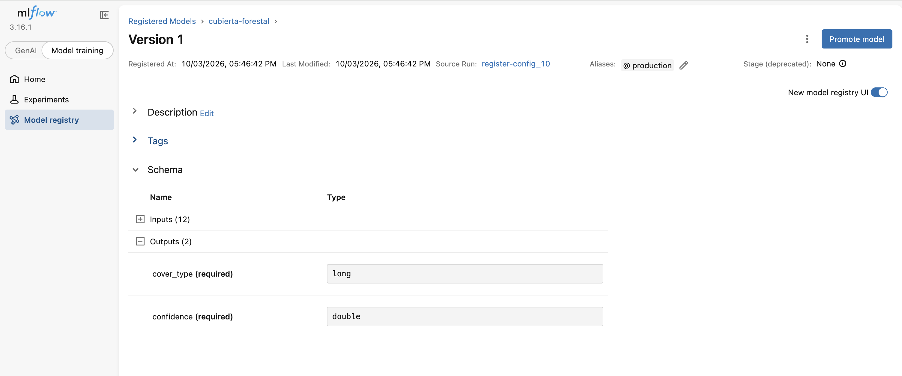

### 5. Artefactos del modelo en MinIO

Consola de MinIO con el bucket `mlflow` (348 objetos) y la carpeta del modelo registrado, que contiene `MLmodel`, `conda.yaml`, `python_model.pkl`, `requirements.txt`, `input_example.json`, `serving_input_example.json`, `pyproject.toml` y las carpetas `artifacts` y `code`.

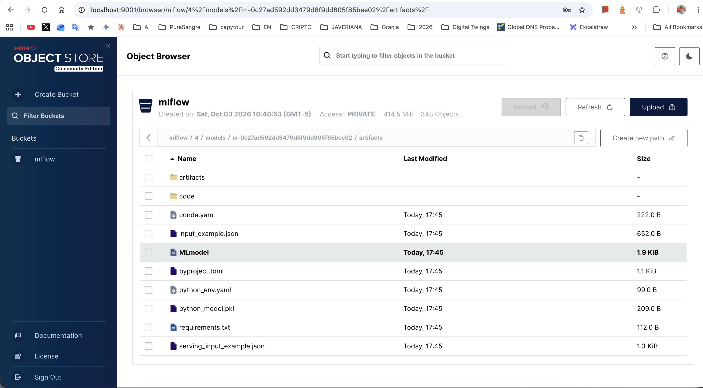

### 6. API de inferencia

`POST /predict` ejecutado desde la documentación interactiva (`/docs`) de la API, accedida por el dominio de OrbStack `inference-api.cubierta-forestal.orb.local`. El servidor responde `200` con las predicciones de las dos instancias de ejemplo (`cover_type` 1 y 2, con `confidence` superior a 0.9999) y los metadatos del modelo servido: `cubierta-forestal`, alias `production`, versión `1`.

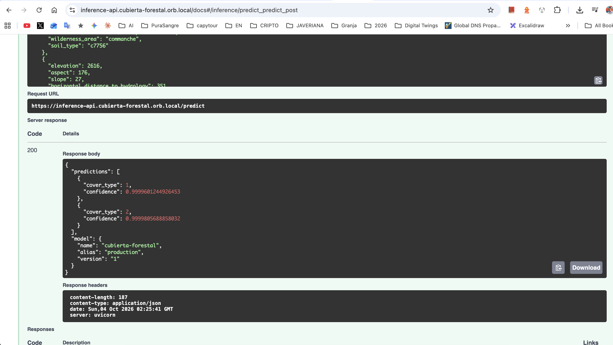
